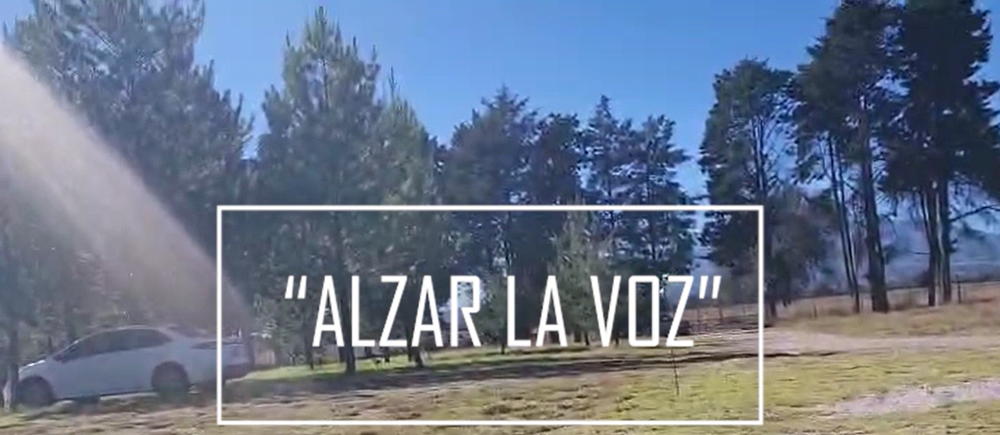
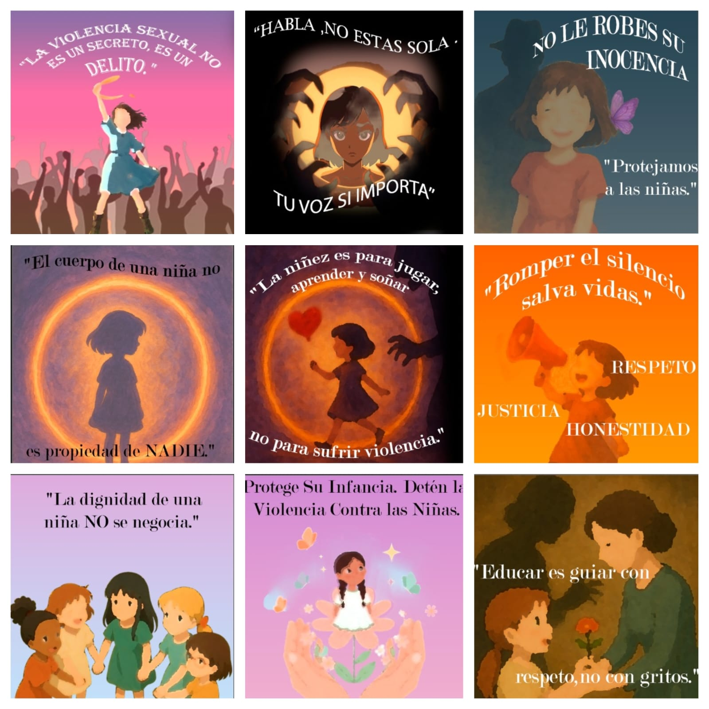
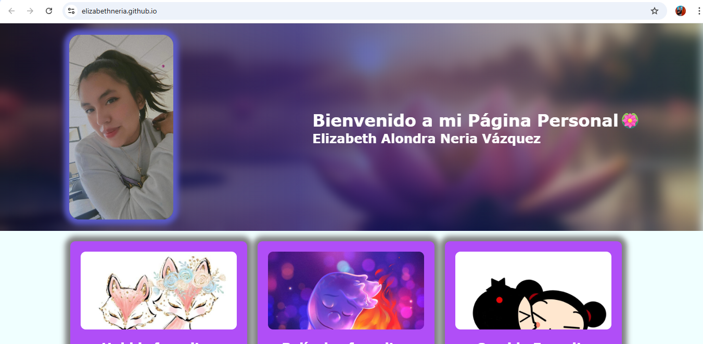
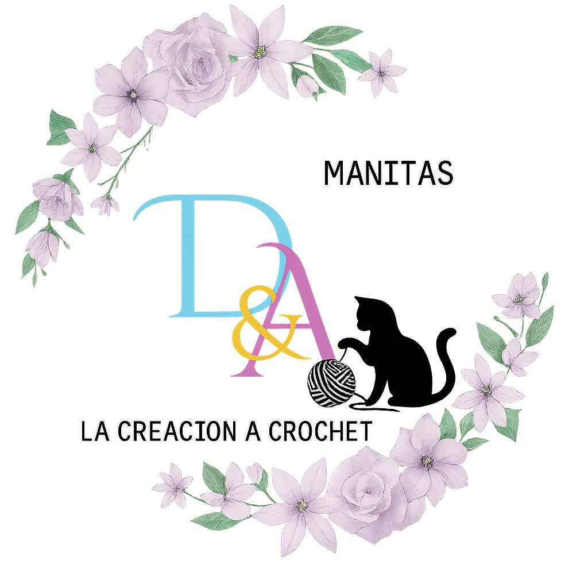

<!-- BANNER -->

  
  <h3 align="center">💜Perfil de desarrollo y actividad profesional</h3>
  

    
  

  🧠 Desarrollo Web | 💻 Backend | 🗄 Bases de Datos  
  🎨 Diseño Digital | 📈 Marketing Digital

---

## 🎯 Perfil Profesional

Estudiante de TSU en Entornos Virtuales y Negocios Digitales con enfoque en el desarrollo de soluciones tecnológicas innovadoras. Me especializo en el desarrollo web y la gestión de bases de datos, integrando además diseño digital y conceptos de marketing para crear proyectos completos, funcionales y visualmente atractivos.

Mi interés principal es el desarrollo backend, así como la implementación de tecnologías emergentes como la realidad aumentada (RA) y la realidad virtual (RV), aplicadas al ámbito educativo y digital.

---

## 👩‍💻 Sobre mí

- 💻 Experiencia en desarrollo web y bases de datos  
- 🌱 Aprendiendo desarrollo Full Stack  
- 🎨 Interés en diseño digital y experiencia de usuario  
- 📈 Conocimientos básicos en marketing digital  
- 🧠 Interés en Realidad Aumentada (RA) y Realidad Virtual (RV)  
- 🎯 Objetivo: Desarrollarme profesionalmente en el área tecnológica  

---

## 🚀 Tecnologías

  

---

## 💼 Proyectos Relevantes

### 🗄 Sistema de Gestión de Base de Datos
Sistema enfocado en la administración de información mediante base de datos relacional.

- Modelo entidad-relación  
- Implementación en PostgreSQL  
- Gestión eficiente de datos  
---

### 💻 Aplicación Web
Sistema web con funcionalidades completas para gestión de usuarios e información.

- Operaciones CRUD  
- Autenticación de usuarios  
- Integración frontend y backend  
---

## 🎨 Diseño Digital y 📈 Marketing

Además del desarrollo, integro diseño y marketing para mejorar la calidad y el impacto de los proyectos.

### 🎨 Diseño Digital

- Diseño de interfaces (UI)  
- Creación de banners y contenido visual  
- Uso de estilos modernos (minimalista, tecnológico)  
- Enfoque en experiencia de usuario (UX)  

  

---

### 📈 Marketing Digital

- Creación de contenido digital  
- Enfoque en usuario y presentación  
- Diseño para redes sociales  
- Estrategias básicas de posicionamiento  

---

## 🎥 Demostración de proyectos y 🖼 Evidencias visuales

  💜 Haz clic en la imagen para ver la demostración del proyecto en video

  

  

  

  

---

## 📈 Actividad

  ✔ Participación en proyectos académicos  
  ✔ Desarrollo de aplicaciones web  
  ✔ Implementación de bases de datos  
  ✔ Creación de interfaces y contenido visual  

---

### 📄 Constancias

  <a href="CERTIFICADO Desarrollador de sitios web responsivos.pdf">
    📜 Constancia de curso
  </a>

  <a href="Elizabeth Alondra Neria Vázquez (1).pdf">
    📜 Certificado de participación
  </a>

  <a href="Elizabeth Alondra Neria Vázquez.pdf">
    📜 Constancia de taller
  </a>

---

## 🧠 Habilidades

- ✔ Desarrollo Backend  
- ✔ Bases de Datos  
- ✔ Desarrollo Web  
- ✔ Diseño Digital  
- ✔ Resolución de Problemas  
- ✔ Pensamiento Analítico  

---

## 🌐 Idiomas

- Español: Nativo  
- Inglés: Básico / Técnico  

--- 

### 📄 curriculum vitae

  <a href="cv_eliza(1).pdf">
    📜 Curriculum vitae
  </a>

## 📬 Contacto

- 📧 Email:alondraneria88@gmail.com
- 📲 Telefono:2471187838
- 💼 GitHub: https://github.com/elizabethneria  

---

<!-- FOOTER -->

  

⭐ *Gracias por visitar mi perfil profesional 💜*
