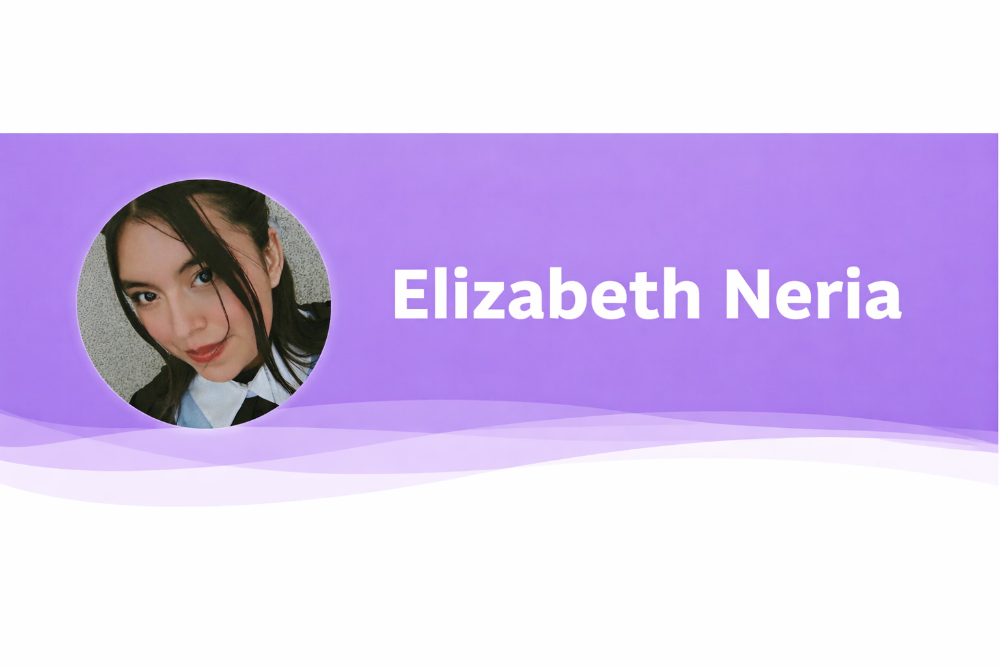

<!-- HEADER VIOLETA ANIMADO -->
<!-- BANNER -->

  
  <h3 align="center">💜 Desarrolladora Web | Backend | Bases de Datos</h3>
  

---

  
  

---

## 👩‍💻 Sobre mí

Soy estudiante de desarrollo de software enfocada en la creación de sistemas web y bases de datos.  
Me interesa el desarrollo backend y el uso de tecnologías modernas para crear aplicaciones eficientes.

- 💻 Experiencia con **Django + PostgreSQL**
- 🌱 Aprendiendo **Full Stack Development**
- 🧠 Interés en **Realidad Aumentada (RA) y Realidad Virtual (RV)**
- 🎯 Objetivo: Trabajar como desarrolladora profesional

---

## 🚀 Tecnologías

  

---

## 📂 Proyectos (Portfolio)

### 🌿 Sistema de Plantas Medicinales con RA/RV

Aplicación interactiva enfocada en educación, integrando tecnologías de realidad aumentada y virtual para visualizar plantas medicinales.

  

---

### 🗄 Sistema de Gestión con PostgreSQL

Sistema de base de datos con modelo entidad-relación, implementación en PostgreSQL y conexión con backend.

  

---

### 💻 Aplicación Web con Django

Sistema web con operaciones CRUD, autenticación de usuarios y conexión completa entre frontend y backend.

  

---

## 🖼 Evidencias / Capturas

  
  

📌 *(Aquí puedes poner screenshots reales de tus sistemas)*

---

## 📊 GitHub Stats

  

---

## 🔥 Lenguajes más usados

  

---

## 🧠 Habilidades

- ✔ Desarrollo Backend
- ✔ Bases de Datos
- ✔ Modelado de Sistemas
- ✔ Frameworks (Django)
- ✔ Resolución de problemas

---

## 📬 Contacto

- 📧 Email: *tu correo aquí*
- 💼 GitHub: https://github.com/elizabethneria

---

<!-- FOOTER -->

  

⭐ *Gracias por visitar mi portfolio 💜*
